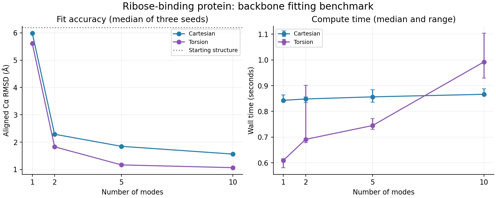

# Measured results: ribose-binding protein

Backbone-only N–Cα–C elastic-network fitting of 1BA2 chain A to 2DRI chain A. This is a target-guided structural benchmark, not molecular dynamics or a free-energy calculation.

Starting aligned Cα RMSD: **6.192238 Å**. Both chains contain 271 matched residues and 813 modeled atoms. The only residue identity mismatch is ARG67 versus ASP67.

| Method | Modes | Median RMSD (Å) | Median compute time (s) | Time range (s) | Max bond change (Å) | Max angle change (degrees) |
|---|---:|---:|---:|---:|---:|---:|
| cartesian | 1 | 5.9915 | 0.843 | 0.837–0.864 | 0.02587 | 4.312 |
| cartesian | 2 | 2.2880 | 0.848 | 0.835–0.856 | 0.3139 | 16.55 |
| cartesian | 5 | 1.8452 | 0.856 | 0.836–0.884 | 0.382 | 27.18 |
| cartesian | 10 | 1.5616 | 0.866 | 0.864–0.887 | 0.6642 | 35.18 |
| torsion | 1 | 5.6130 | 0.610 | 0.581–0.616 | 1.914e-13 | 9.796e-12 |
| torsion | 2 | 1.8276 | 0.691 | 0.678–0.902 | 1.97e-13 | 1.781e-11 |
| torsion | 5 | 1.1657 | 0.745 | 0.730–0.773 | 2.207e-13 | 1.267e-11 |
| torsion | 10 | 1.0638 | 0.992 | 0.929–1.104 | 1.87e-13 | 1.413e-11 |

## Interpretation

The torsion model reaches lower Cα fitting error at each tested mode count in this run and preserves the starting backbone bond lengths and angles. The Cartesian fits distort local backbone geometry substantially. A low RMSD alone therefore does not establish a physically usable conformer.

These are measurements from one machine with three initialization seeds per configuration. The methods use the same target, atom selection, contact potential, L-BFGS-B implementation, iteration cap, and amplitude bounds, but they explore different constrained spaces. This measures the implemented pipelines; it does not isolate coordinate representation alone or prove that one algorithm is universally faster.

No all-atom relaxation is included. Neither side chains, hydrogens, solvent nor ribose are modeled. Geometry screens only concern the represented backbone; do not interpret zero backbone close contacts as an all-atom validation.

Peak RSS is the whole fresh worker-process maximum, including imports, mode construction, fitting and display-frame generation. It is not incremental algorithm memory, and is unavailable on Windows with the standard-library implementation. Compute time excludes display-frame generation and output writing. Parent process launch and disk cache effects are not included in compute time.

The chronological histories record the best objective value among optimizer evaluations, including trial points. threshold_times.csv gives RMSD-only threshold times; geometry was evaluated at the final result rather than every history point. Do not interpret these as times to a fully validated structure.

Optimizer success: 24/24 runs. Eigenmode calculations found six Cartesian rigid-body zero modes; torsion rank and spectrum are recorded per run.

## Reproducibility

See manifest.json for platform, dependency versions, single-thread settings, input SHA-256 hashes, seeds and run arguments. Run python check_model.py, python benchmark.py and python report.py from the project directory. Timings will vary on other computers.

## Files

- viewer.html: standalone interactive 3D Cα traces and measured convergence curves.
- summary.csv / aggregate.csv: individual and grouped measurements.
- threshold_times.csv: threshold success/failure with no fabricated times.
- *_k*_seed*.json: full coordinates, display frames, geometry, modes metadata and histories.
