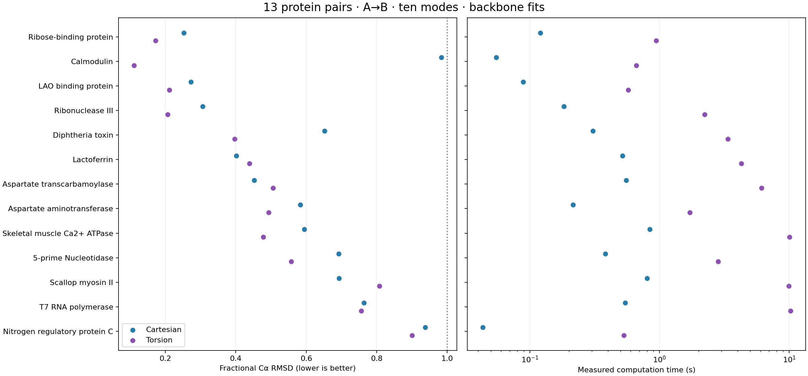

# Thirteen protein structure pairs: measured benchmark

Attempted 52 method × direction runs across 13 structure pairs. 52 converged, 0 did not converge or failed. These are N–Cα–C backbone fits with the target provided during optimization.

## Individual results

| Protein | Direction | Matched residues | Internal chain breaks | Initial RMSD (Å) | Cartesian fRMS | Torsion fRMS | Cartesian time (s) | Torsion time (s) |
|---|---|---:|---:|---:|---:|---:|---:|---:|
| Ribose-binding protein | A→B | 271 | 0 | 6.19 | 0.252 | 0.172 | 0.12 | 0.94 |
| Ribose-binding protein | B→A | 271 | 0 | 6.19 | 0.408 | 0.575 | 0.13 | 1.22 |
| Calmodulin | A→B | 138 | 1 | 14.73 | 0.983 | 0.111 | 0.06 | 0.66 |
| Calmodulin | B→A | 138 | 1 | 14.73 | 0.709 | 0.328 | 0.04 | 0.47 |
| LAO binding protein | A→B | 238 | 0 | 4.70 | 0.272 | 0.211 | 0.09 | 0.57 |
| LAO binding protein | B→A | 238 | 0 | 4.70 | 0.702 | 0.790 | 0.10 | 0.63 |
| Ribonuclease III | A→B | 438 | 0 | 7.26 | 0.306 | 0.206 | 0.18 | 2.23 |
| Ribonuclease III | B→A | 438 | 0 | 7.26 | 0.294 | 0.132 | 0.22 | 2.85 |
| Diphtheria toxin | A→B | 523 | 1 | 15.63 | 0.652 | 0.396 | 0.31 | 3.37 |
| Diphtheria toxin | B→A | 523 | 1 | 15.63 | 0.747 | 0.427 | 0.50 | 4.10 |
| Lactoferrin | A→B | 691 | 0 | 6.43 | 0.401 | 0.439 | 0.52 | 4.27 |
| Lactoferrin | B→A | 691 | 0 | 6.43 | 0.502 | 0.492 | 0.40 | 4.17 |
| Aspartate transcarbamoylase | A→B | 912 | 0 | 4.93 | 0.452 | 0.505 | 0.55 | 6.14 |
| Aspartate transcarbamoylase | B→A | 912 | 0 | 4.93 | 0.459 | 0.460 | 0.50 | 7.79 |
| Aspartate aminotransferase | A→B | 401 | 0 | 1.66 | 0.583 | 0.493 | 0.21 | 1.71 |
| Aspartate aminotransferase | B→A | 401 | 0 | 1.66 | 0.518 | 0.532 | 0.22 | 1.78 |
| Skeletal muscle Ca2+ ATPase | A→B | 994 | 0 | 13.97 | 0.594 | 0.478 | 0.84 | 10.03 |
| Skeletal muscle Ca2+ ATPase | B→A | 994 | 0 | 13.97 | 0.864 | 0.710 | 0.82 | 16.56 |
| 5-prime Nucleotidase | A→B | 525 | 0 | 9.33 | 0.692 | 0.557 | 0.38 | 2.84 |
| 5-prime Nucleotidase | B→A | 525 | 0 | 9.33 | 0.652 | 0.413 | 0.41 | 6.79 |
| Scallop myosin II | A→B | 1078 | 7 | 27.46 | 0.693 | 0.808 | 0.80 | 9.96 |
| Scallop myosin II | B→A | 1078 | 7 | 27.46 | 0.742 | 0.900 | 0.86 | 9.34 |
| T7 RNA polymerase | A→B | 843 | 3 | 18.27 | 0.764 | 0.756 | 0.54 | 10.21 |
| T7 RNA polymerase | B→A | 843 | 3 | 18.27 | 0.976 | 0.747 | 1.07 | 7.86 |
| Nitrogen regulatory protein C | A→B | 123 | 1 | 3.25 | 0.937 | 0.900 | 0.04 | 0.53 |
| Nitrogen regulatory protein C | B→A | 123 | 1 | 3.25 | 0.930 | 0.915 | 0.04 | 0.25 |



Across 26 directly paired direction tests, the torsion implementation had lower fitted Cα fractional RMSD in 18. The number describes these inputs and this prototype; it is not a statistical claim about all proteins.

## Scientific limits

- Pair matching uses author residue keys when they cover at least 75% of the smaller structure with at least 80% identical residues; otherwise it uses exact sequence blocks. Missing and unmatched residues are excluded from both structures. See each run JSON for the matching method and sequence differences.
- A chain break is recorded when adjacent matched backbone segments have a C–N distance over 1.8 Å. No torsion is assigned across that break. These pairs cannot be compared to the paper as full-chain models. Multi-chain models include six relative rigid-body degrees of freedom per additional chain.
- The paper used different atom and mode models and a different optimizer. Do not compare these numeric fRMS values to published all-atom fRMS as a reproduction.
- Cartesian outputs can stretch bonds and change angles. The summary CSV records each model’s maximum backbone changes. A low RMSD is a structural fitting score and is not a physical conformer or a free-energy estimate.
- Timings use one CPU thread and include PDB preparation, network, modes, fit and final backbone geometry check. Cache, process startup and optional viewer generation are excluded; these timings are environment-specific. Peak RSS includes Python and imported libraries.
- One initialization seed and ten modes are used for each direction. Larger samples, seed repeats and cutoff sensitivity checks are needed before general performance claims.

Forward pairs without internal matched-chain breaks: 8/13 (Ribose-binding protein, LAO binding protein, Ribonuclease III, Lactoferrin, Aspartate transcarbamoylase, Aspartate aminotransferase, Skeletal muscle Ca2+ ATPase, 5-prime Nucleotidase).

## Reproduce

From the project directory with dependencies installed:

```bash
python benchmark_13.py --both-directions --k 10 --seed 0
python cohort_report.py
```

To run another protein pair, see the README and pass local PDB paths and corresponding chain IDs to `benchmark_13.py`.
